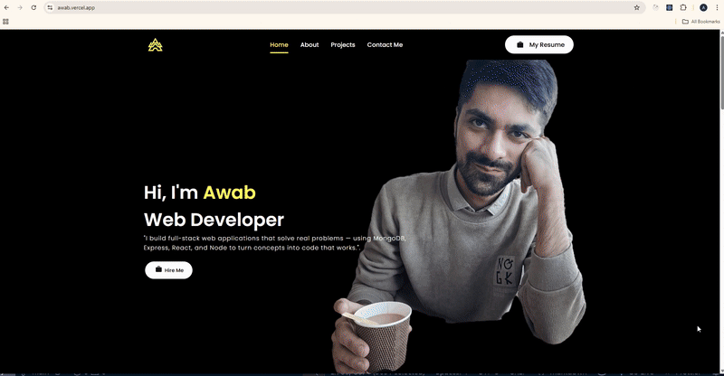

# Awab Portfolio


🔗 [Visit Live Website](https://awab.vercel.app)

## 📌 About

This is a modern and responsive personal portfolio website built using **React** and deployed on **Vercel**.  
It highlights my skills, showcases my projects, and provides a way to get in touch.
    
---

## 🚀 Features

- 💻 Responsive design for all devices
- 🌐 Live project previews
- 🔧 Skills & tools showcase
- 📬 Contact section with form
- ⚡ Fast and lightweight

---

## 🛠️ Tech Stack

- React
- JavaScript (ES6+)
- HTML5 & CSS3
- Vercel (Deployment)

---

## 🧩 Getting Started Locally

To run this project on your local machine:

```bash
# Clone the repository
git clone https://github.com/sheikhawab/portfolio

# Navigate into the project folder
cd portfolio

# Install dependencies
npm install

# Start development server
npm start
